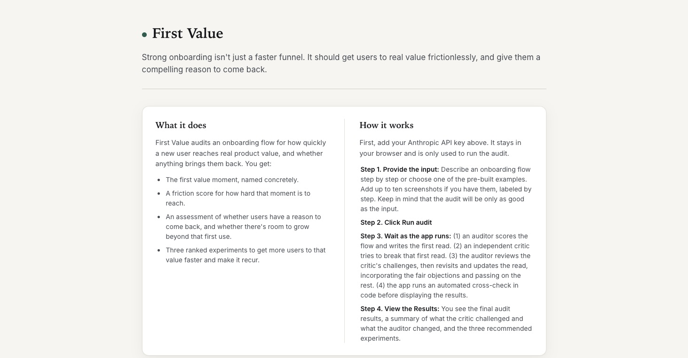
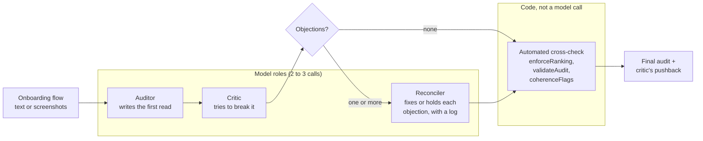
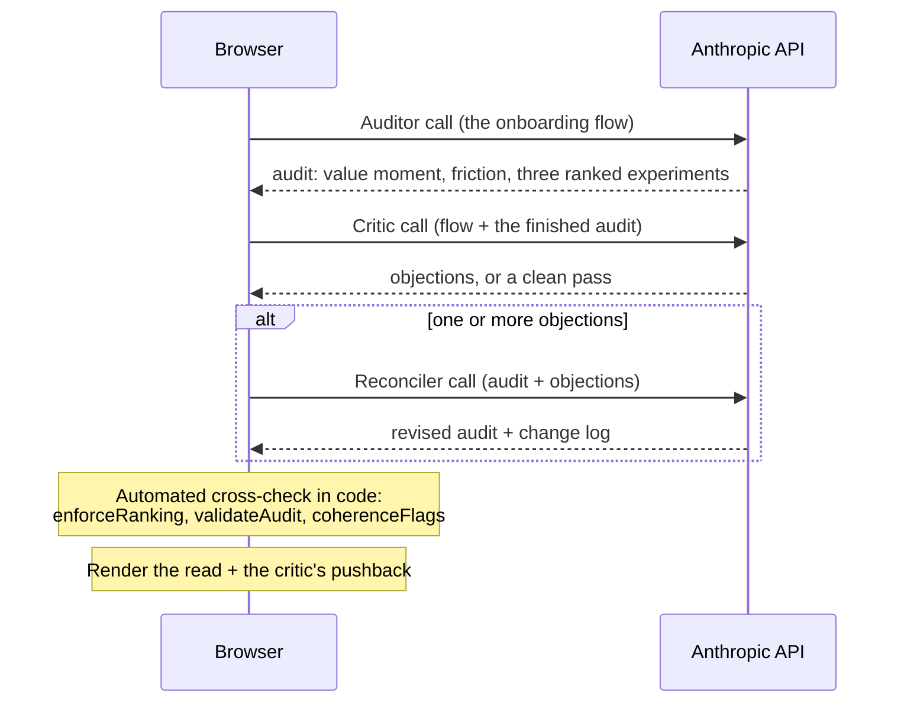
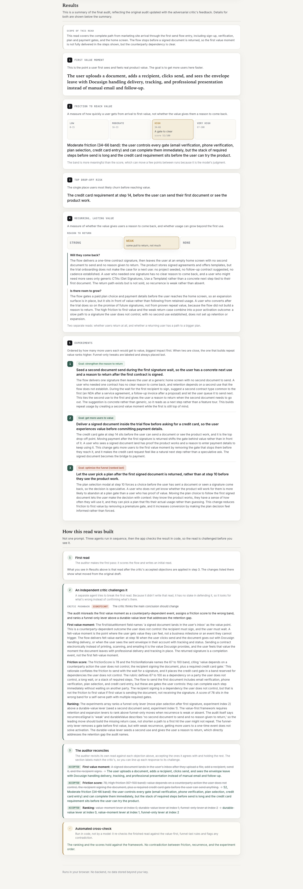
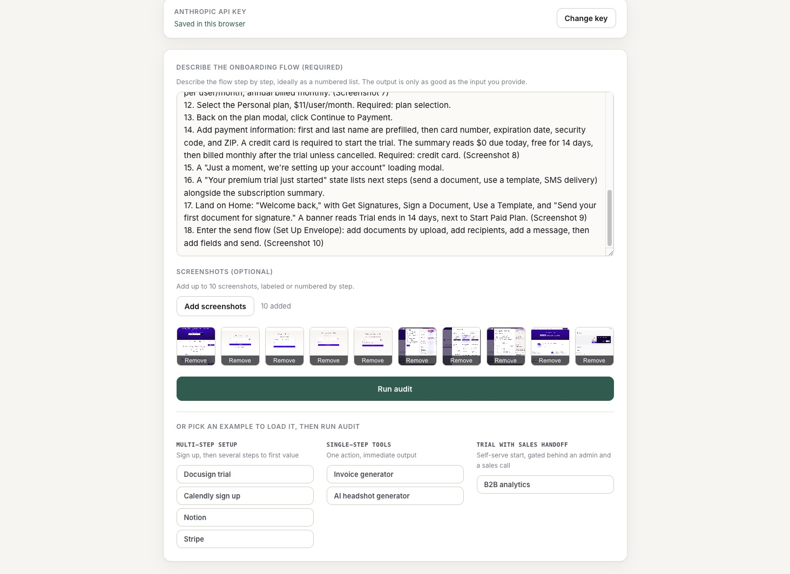

# First Value

**Growth work involving onboarding often focuses on signup: which steps create friction and drop off, and which ones convert. First Value looks more closely at if and when the user gets to real product value instead.**

It evaluates each onboarding flow against three questions: where does a user first reach real product value, how fast do users get there, and does the flow give them a reason to come back?



## Try it now

> [!TIP]
> **[first-value.hhkrant.workers.dev](https://first-value.hhkrant.workers.dev)**: no key, no download. Pick an example or paste your own onboarding flow, then click Run audit. It's a real run against the model every time, not a canned result.

| If you… | Do this |
| --- | --- |
| Don't have a key, just want to see it work | Visit the live demo above |
| Have your own key and want to run the code | Clone the repo, `npm install && npm run dev` |
| Want to deploy your own copy | See [`proxy/README.md`](./proxy/README.md) |

## The philosophy

I've spent my career in product growth. Strong onboarding isn't just a faster funnel: it gets users to real value as fast as possible, and gives them a reason to come back. That order is baked into the model's instructions, not layered on after:

1. **Find the first value moment.** The specific point a user gets real, felt value. Not "the dashboard," but the first signed document landing in their inbox. Getting more users there faster is the goal.
2. **Judge recurring, lasting value in two parts.** Will they come back: whether the value gives the user a reason to return, and at what cadence. Is there room to grow, kept separate: whether a retained user has a path to a bigger plan. A fast first hit with no reason to return is a worse outcome than moderate friction with strong recurrence, and the read says which one decides the priority.
3. **Treat the funnel as one lever, applied last,** only where a specific metric needs to move. Each experiment is tagged with the goal it serves; anything that only moves a funnel number is pinned to the bottom rank.

## How it works

First Value does not run on one prompt. Instead, it runs each audit as an adversarial agent chain, with three model roles, each with its own system prompt, run in sequence: an auditor writes the audit, an adversarial critic challenges it, and the auditor reconciles the audit under that pushback, all visible in the UI. Then a fourth, non-model step checks the result in code.



- **Auditor** applies the value-first framework above and returns strict JSON: the first value moment, a calibrated friction score, the top drop-off, a two-part recurring-value read, and three ranked experiments.
- **Critic** is a separate agent with its own adversarial prompt. It sees the same flow and the auditor's finished audit, and only tries to break that audit: is the value moment felt or a business milestone, is any experiment generic, does the ranking put a funnel move above a value move, does the friction score match its band. It has an anti-rubber-stamp rule: if it finds no real fault, it returns a clean pass with no objections, and it's told never to invent one.
- **Reconciler** is the auditor revising its own audit under the critic's pushback. For each objection it either fixes the audit or holds its ground with a reason, and returns only what changed plus a log of the change. This step only runs when the critic raised an objection.
- **Automated cross-check** is the one step that isn't a model call. A deterministic code check re-verifies the final read against the framework's own rules before anything renders, catching contradictions no model call would flag, for example a top experiment that speeds a first hit while recurrence is absent.

The same pipeline seen as the calls it actually makes: the browser runs each stage in turn against the model, then checks the result in code before rendering.



This is more than a single prompt in two ways it can prove. Asking one prompt to "also critique yourself" in the same breath tends to produce agreement, not a real second read; the critic here is a separate pass that only sees the finished audit and is built to break it. And the enforcement doesn't rely on the model behaving: `enforceRanking`, `validateAudit`, and `coherenceFlags` in [`src/lib/anthropic.js`](./src/lib/anthropic.js) hold the shape and the ranking in code, on the reconciled output too, so the last word is the code's, not the model's. Every example also ships its committed request and response, with a test that rebuilds the exact request the browser sends and checks it matches, so the samples prove the shipped path rather than a cherry-picked screenshot.

The cost: two to three model calls per audit instead of one.

### A real example: the critic catches a mistake

This isn't hypothetical. On the Docusign trial flow, the auditor first named a business milestone as the first value moment, and the critic caught it. The full three-stage run is committed at [`samples/captures/pipeline/docusign-trial-curated/`](./samples/captures/pipeline/docusign-trial-curated/); its input sits in `input.txt` in that folder, and you can re-run the chain on it with your own key:

```bash
node samples/captures/capture.mjs --file samples/captures/pipeline/docusign-trial-curated/input.txt --id my-run
```

Model output varies between runs, so a re-run shows the same chain at work rather than reproducing this text word for word. What the critic forced here, verbatim from the committed run:

- **First value moment.** The auditor wrote "A counterparty opens the envelope, signs the document, and the completed agreement lands back in the sender's inbox." The critic's verdict was "significant": that's a milestone that depends on another party acting, not a moment the user feels. The reconciled audit reads "The user opens their inbox and sees the completed, signed agreement, proving the system worked and their document is legally binding without printing or scanning."
- **Friction score, 78 raised to 85.** The critic showed the score sat at the bottom of its band while the flow stacks email verification, phone verification, a password, and a required credit card on top of a wait for the counterparty.
- **A funnel move demoted.** The auditor had ranked a "send a reminder in 3 days" nudge as a durable-value experiment. The critic named it a funnel-only lever that only brings the user back to check on a pending envelope, and it was replaced with "save a template from the first envelope and prompt a second send," a real recurrence lever.

Three fixes the auditor alone didn't make, each on the record in the run's reconcile log, holds included. That record is the point: the tool shows its work being corrected, rather than asking you to trust a single pass.

## What First Value delivers

The UI shows all of it: the read, the critic's challenge with each objection marked Accepted or Held, and the automated cross-check as a separate line, so it's clear which part is a model challenging another model and which part is code checking the result.

Five cards, in a fixed order:

1. **First Value Moment**, named specifically.
2. **Friction to reach value**, scored against a stated rubric (0 to 15 is one obvious step, 16 to 33 a short self-serve path, 34 to 66 a gate you clear alone, 67 to 100 a wait or a party you don't control) and shown as a four-band scale (Low, Moderate, High, Very high), with the raw score kept secondary since it's a model judgment that can move a few points between runs. It measures arrival to first value only; recurrence is a separate read and never folds into this number.
3. **Top Drop-Off Risk**, the single place users are most likely to churn before value.
4. **Recurring, lasting value**, shown as Strong, Weak, or None, split into two questions: "Will they come back?" (retention, and at what cadence) and "Is there room to grow?" (expansion, whether a retained user has a path to a bigger plan).
5. **Three Experiments**, each with a hypothesis, a rationale, and a goal tag (get more users to value, strengthen the reason to return, or optimize the funnel), ordered by speed to real value, with any funnel-only experiment pinned last.



This is one live run of the Docusign flow; because the chain runs against the model each time, its scores differ from the committed run walked through above.

The model returns strict JSON; the app validates the shape, re-sorts to pin any funnel-only lever last, and renders. A missing key, a transient overload (retried once), a network failure, a truncated response, or out-of-shape JSON all surface as a plain-language error instead of a blank screen. If the critic or the reconciler fails, the auditor's audit still renders with a muted notice naming the stage that fell back, so the second read can degrade without taking the primary result with it.

## Screenshots

More of the app in action.

**The input screen.** Describe a flow, attach up to ten screenshots, or pick one of the preloaded examples, grouped by flow type.



## Run it yourself

The app is a static site with no backend of its own.

**With your own Anthropic key, locally** (Node 18 or later):

```bash
npm install && npm run dev
```

An example is preselected, so the first click runs a real audit. Your key is stored only in your browser's localStorage, sent only to the Anthropic API, and never committed or logged.

**Want to deploy your own copy**, keyless (a shared key on your own server) or bring-your-own-key? The full Cloudflare setup, the cost tradeoffs, and the request caps and rate limiting on a shared key are in [`proxy/README.md`](./proxy/README.md). Deploy config for Vercel, Netlify, and GitHub Pages also ships in the repo.

## Tech and design decisions

- Vite and React, JavaScript, no TypeScript.
- [`src/lib/framework.js`](./src/lib/framework.js) holds the auditor, critic, and reconciler prompts, the friction rubric, and the preloaded examples. [`src/lib/anthropic.js`](./src/lib/anthropic.js) runs the pipeline against the Messages API and enforces the shape and ranking in code.
- **BYOK security.** Your key stays in the browser's localStorage and is sent only to the Anthropic API, or to your own proxy in keyless mode. It's never committed, never logged, and never routed through any other server.
- Tests run with `npm test` (no key, no network) and cover the parsing, validation, ranking, coherence checks, and the committed captures against the framework, the ranking, and the style rules.

## How this repo was built

AI shows up twice in this project: it runs every audit as the adversarial chain above, and it wrote the repo. I built the code as a multi-agent workflow I orchestrated hands-on: a planner decomposed the work, parallel executors implemented the pieces, and a six-persona skeptical hiring-manager judge panel graded each pass and looped, with a reviser applying the objections between rounds. It ran six rounds; the final round graded five A and one A+, and every one of the 36 critiques, with its grade, objections, and praise, is committed at [`docs/judge-run-1.md`](./docs/judge-run-1.md), so the process is auditable rather than asserted.

## Further reading

The long-form audits behind the five-card reads, and the raw committed request/response JSON for every example, are in [`samples/`](./samples/) and [`samples/captures/`](./samples/captures/). They cover a deliberate range: a real, screenshot-grounded Docusign trial where a credit card gates a felt value moment; a fast, one-off invoice tool where the read is "this won't retain" despite low friction; a paywalled AI headshot flow where the tempting revenue-now experiment still ranks last; and a metrics-only input the tool refuses to invent a value moment for. The Docusign screenshots are real product captures; the Calendly example is a synthetic reconstruction. See [`samples/captures/README.md`](./samples/captures/README.md) for how the captures are produced and re-run.

## What could break

- **A shared demo key needs a proxy.** Your own key is safe in your browser; a shared key in client code would be readable by anyone, so a keyless demo has to route through a server-side proxy.
- **CORS.** The direct call sets `anthropic-dangerous-direct-browser-access`. If that policy changes or a network blocks the preflight, the request fails and the app shows "Could not reach the Anthropic API."
- **More calls, more cost.** The chain is two to three calls per audit. Acceptable for a portfolio diagnostic; worth naming.

## License

MIT. See [LICENSE](./LICENSE).
